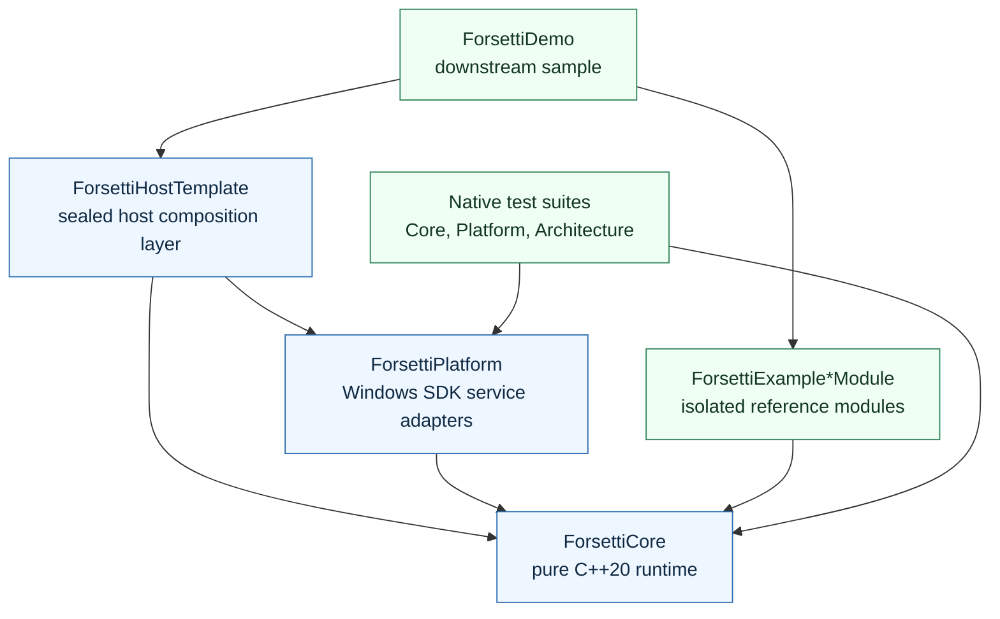
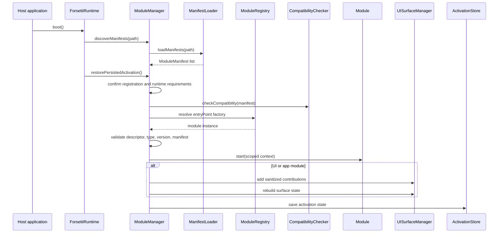

# Forsetti Framework - Windows

Forsetti Framework - Windows is a modular runtime framework for Windows 11 applications. It is built with C++20, MSVC, CMake, vcpkg, and native Windows SDK service adapters.

The framework centers on a compatibility-governed module model: modules declare identity, platform support, capabilities, entitlement requirements, and optional UI contributions. The runtime validates those declarations before activation, scopes module access to approved services, and keeps UI surface state under framework control.

The repository now includes the sealed `ForsettiHostTemplate` composition layer, Windows platform adapters, isolated example modules, downstream demo wiring, module templates, and native test suites.

## What Forsetti Provides

| Area | Repository Contract |
|---|---|
| Module lifecycle | Manifest discovery, compatibility validation, entitlement checks, activation, deactivation, and restore diagnostics |
| Service modules | Multiple service modules can run concurrently |
| UI/app modules | UI and app modules share one active surface slot |
| Capability governance | Runtime service access and UI contribution features are scoped to declared capabilities |
| Module communication | Module-to-module messages are framework-mediated and source identity is assigned by scoped context |
| UI composition | Toolbar items, view injections, and overlay schemas are contributed by the active UI/app module |
| Platform services | WinHTTP networking, Registry storage, DPAPI secure storage, constrained local file export, and no-op telemetry |
| Guardrails | Local scripts verify build, tests, dependency boundaries, manifests, compatibility checks, and script regressions |

## Architecture At A Glance



The hard dependency rule is one-way only:

- `ForsettiCore` depends on nothing in the repository.
- `ForsettiPlatform` depends on `ForsettiCore`.
- `ForsettiHostTemplate` depends on `ForsettiCore` and `ForsettiPlatform`.
- `ForsettiExampleServiceModule`, `ForsettiExampleUIModule`, and `ForsettiExampleAppModule` each depend on `ForsettiCore` and not on each other.
- `samples/ForsettiDemo` is downstream demonstration code and may compose the host and example modules.
- Reverse and lateral includes are blocked by tests and scripts.

## Runtime Flow



Activation fails before `start()` when compatibility, entitlement, capability, or factory identity checks fail. UI/app activation preserves the single active surface slot and cleans up the previous active UI/app module.

## Repository Layout

| Path | Purpose |
|---|---|
| `include/ForsettiCore` | Public runtime, module, manifest, event, service, capability, and UI surface contracts |
| `src/ForsettiCore` | Core runtime implementation with no platform dependencies |
| `include/ForsettiPlatform` | Public Windows platform adapter contracts |
| `src/ForsettiPlatform` | Windows SDK implementations for networking, storage, secure storage, file export, and telemetry |
| `include/ForsettiHostTemplate` | Public host controller, bootstrap, overlay router, state, and surface adapter contracts |
| `src/ForsettiHostTemplate` | Sealed host composition implementation |
| `src/ForsettiExampleServiceModule` | Isolated reference service module and manifest |
| `src/ForsettiExampleUIModule` | Isolated reference UI module and manifest |
| `src/ForsettiExampleAppModule` | Isolated reference app module and manifest |
| `samples/ForsettiDemo` | Downstream demonstration composition root |
| `templates` | Windows module and host starter templates |
| `tests` | Native CppUnitTest suites surfaced through CTest |
| `Scripts` | Local guardrail, compatibility, manifest, dependency, and discussion automation scripts |
| `.github` | Pull request template, label/release metadata, discussion automation config, and remote marker workflow |
| `docs/governance` | Repository-grounded governance and discussion automation documents |
| `.forsetti/alignment` | Phase evidence and acceptance reports for runtime-boundary alignment work |

## Build And Test

### Prerequisites

- Windows 11
- Visual Studio 2022 with the Desktop development with C++ workload
- CMake 3.28 or newer
- vcpkg with `VCPKG_ROOT` set
- PowerShell 7 or Windows PowerShell

### Configure, Build, And Test

```powershell
cmake --preset debug
cmake --build --preset debug
ctest --preset debug --output-on-failure
```

The repository currently defines `debug` and `release` CMake presets. The package-level `windows-msvc-debug` name is not a repository preset.

### Full Local Guardrail Wrapper

Run this for full local verification:

```powershell
.\Scripts\verify-forsetti-guardrails.ps1
```

The wrapper performs:

1. CMake configure with the `debug` preset.
2. CMake build with the `debug` preset.
3. CTest execution.
4. Architecture checks.
5. Dependency checks.
6. Manifest validation.
7. Pull request compatibility checks.
8. Script regression tests.

## Module Manifest Baseline

Manifests live under `ForsettiManifests` directories and use JSON with exact platform/capability casing. Schema `1.0` remains loadable with safe default runtime requirements; current manifests use schema `1.1`:

```json
{
  "schemaVersion": "1.1",
  "manifestTemplateVersion": "1.1",
  "moduleID": "com.forsetti.module.example-service",
  "displayName": "Example Service",
  "moduleVersion": { "major": 0, "minor": 1, "patch": 0, "prerelease": null },
  "moduleType": "service",
  "supportedPlatforms": ["Windows"],
  "minForsettiVersion": { "major": 0, "minor": 2, "patch": 0, "prerelease": null },
  "maxForsettiVersion": null,
  "capabilitiesRequested": ["storage", "telemetry"],
  "iapProductID": null,
  "entryPoint": "ExampleServiceModule",
  "defaultModuleRole": null,
  "runtimeRequirements": {
    "io": [
      {
        "requirementID": "storage.example-state",
        "kind": "storage",
        "access": "read_write",
        "required": true,
        "description": "Private example service state."
      }
    ],
    "ui": null,
    "dataIsolation": {
      "mode": "private_to_module",
      "ownedStoreIDs": ["example-service-state"],
      "requiredDefaultRoles": []
    }
  }
}
```

Supported module types are `service`, `ui`, and `app`.

Module-requestable capabilities are:

- `networking`
- `storage`
- `secure_storage`
- `file_export`
- `crypto_utilities`
- `telemetry`
- `routing_overlay`
- `toolbar_items`
- `view_injection`
- `event_publishing`
- `shared_database`
- `authentication`
- `diagnostics`
- `api`
- `security`

The runtime also recognizes `ui_theme_mask` for declared, policy-approved UI theme IDs. Framework host chrome remains framework-owned.

## Documentation Map

Repository documents:

- `README.md` - primary repository entry point.
- `CHANGELOG.md` - release and notable change history.
- `CONTRIBUTING.md` - open-source use policy; outside contributions are not accepted.
- `wiki.md` - tracked index for the public GitHub Wiki.
- `docs/governance/github-discussion-automation.md` - discussion automation design.
- `docs/governance/discussion_moderation_policy.md` - discussion moderation policy.
- `implementation-policy.json` - machine-readable coding policy and invariants.
- `framework-policy.json` - machine-readable framework architecture and API summary.

Public Wiki:

- [Forsetti Framework - Windows Wiki](https://github.com/flynn33/Forsetti-Framework-Windows/wiki)

The Wiki contains detailed pages for architecture, runtime lifecycle, module manifests, runtime requirements, module registration, capabilities, UI surface behavior, platform services, build/test guardrails, governance, API reference, and roadmap decisions. The repository-tracked `wiki.md` file mirrors the live page set and should be updated with the live Wiki.

## Current Alignment Status

Runtime-boundary alignment is merged into `main`, and evidence is tracked under `.forsetti/alignment`. The canonical local verification path remains `.\Scripts\verify-forsetti-guardrails.ps1` on a Windows/MSVC environment with CMake, CTest, PowerShell, and `VCPKG_ROOT` available.

Native Debug/Release validation is complete. All guardrail scripts pass. 173/177 tests pass (4 pre-existing test fixture bugs in service container type registration have been fixed).

## Patent Notice

The architecture and design of Forsetti are the subject of a pending U.S. patent application:
**Compatibility-Governed, Entitlement-Aware Modular Runtime Framework for Native Application Modules** - U.S. Application No. 63/999,606, filed March 8, 2026. Patent Pending.

## Contributing

This project is open source under Apache License, Version 2.0. You are welcome to use, modify, and redistribute the code under that license.

Outside contributions to this repository are not accepted. Pull requests and collaboration requests will not be reviewed or merged. See [CONTRIBUTING.md](CONTRIBUTING.md).

## License

Copyright 2026 James Daley

This project is licensed under the Apache License, Version 2.0.
See the [LICENSE](LICENSE) file for the full terms.
