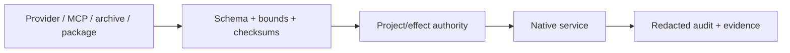

  

# Security

Forge Conductor is a local, current-user product with explicit project authority. Provider input, MCP arguments, imported archives, instruction packages, and shell commands are treated as untrusted.

## Trust boundaries

## Core controls

| Area | Control |
| --- | --- |
| Project paths | Canonical handle-based resolution, reparse-point defense, authority generation |
| Named pipes | Current-user ACL, remote rejection, impersonation + SID compare, nonce, bounded frames |
| Dashboard | Literal loopback bind, exclusive address use, host/origin policy, DPAPI-backed bearer |
| Secrets | DPAPI CurrentUser; never configuration JSON, project memory, logs, or exports |
| Child processes | Explicit executable, inherited-handle allowlist, bounded pipes, Job Object, deadline |
| Shell | Owner-enabled policy plus separate shell/execute authority; ordinary OS account permissions |
| Imports/packages | Size, encoding, schema, path, project identity, checksum, and stale-preview validation |
| Installer | Hash, signer, package identity, trust, version, and exact payload verification |

## Workspace authority

An authorized project root is not a string prefix. Forge Conductor opens paths, resolves final locations, rejects escapes and unsafe Windows path forms, and invalidates stale grants through generation changes.

The owner can select ordinary local-volume host access or workspace/configured-root mode. Relative artifact paths retain the selected project default. Models cannot change the owner's filesystem mode or grant new roots. Native ACL/reparse/path checks remain, and shell cwd authorization is separate from an OS sandbox for absolute arguments, later directory changes or networking.

Independent workers and schedules freeze admitted roots/grants/tools and intersect them with the current issuer policy. Later privilege increases cannot broaden them; removed scope fails explicitly. Task/authorization references are audit context rather than proof of a human identity. Recursive workers/schedules, authority mutation and governance approval remain excluded from worker tools. Uncertain effects are not replayed automatically.

## Network posture

The Manager dashboard binds only `127.0.0.1` and `::1`. LM Studio normally uses loopback; a LAN provider must be explicitly configured. Tools are not exposed as a public HTTP API, and `/api/tools/call` remains unavailable.

Dedicated WinHTTP tools access explicitly supplied remote HTTP/HTTPS targets, with bounded headers/bodies/results and actual status. Only GET/HEAD follow redirects; mutating requests retain their observed response without automatic replay. Ambient browser cookies and external account credentials are not invented. Local Windows toast payloads omit model output and remote content and do not change notification settings or recipients.

## Evidence and privacy

Audit records use redacted arguments and canonical digests. Native check receipts store command/output digests and bounded metadata rather than replaying raw project text into exports. Support artifacts must be reviewed before external sharing.

## Installer posture

Development trust is explicit and limited to the published public certificate. The installer does not disable SmartScreen, UAC, Defender, certificate validation, firewall, or global execution policy.

**Next:** [Native Tools](Native-Tools) · [Persistence](Persistence) · [Troubleshooting](Troubleshooting)
